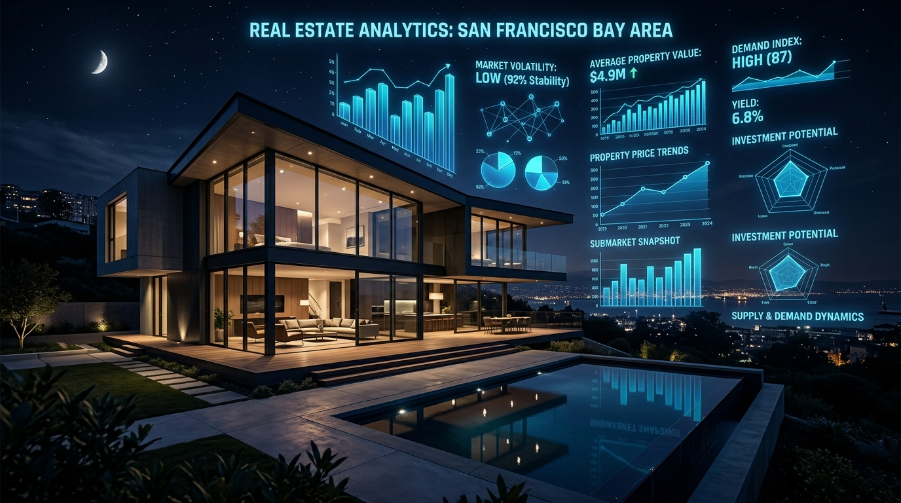
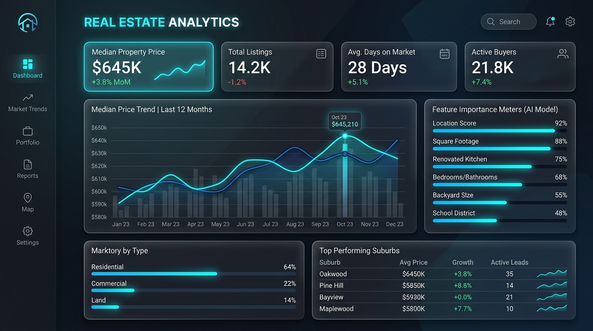

# Real Estate Price Prediction Engine & Production Live API System

> Real-time Machine Learning Hedonic Valuation Platform powered by Live FRED Economic Data and OpenStreetMap Geocoding APIs.

[](https://github.com/Hellthefox808/Real-estate-price-prediction/actions)
[](https://www.python.org/)
[](LICENSE)
[](SECURITY_AUDIT_REPORT.md)
[](DATA_AUDIT_REPORT.md)
[](DATA_AUDIT_REPORT.md)

---



**Version:** `1.0.0` | **Status:** `Production Ready` | **Author & Architect:** **Ravi Ranjan Singh**

---

## 🏛️ Executive Summary & Vision

Static real estate valuation models decay rapidly when interest rates or inflation fluctuate. The **Real Estate Price Prediction Engine** solves this problem by combining a Scikit-Learn Gradient Boosting ML Valuation Model ($R^2 = 0.9616$) with **real, live external API streams** from the Federal Reserve Bank of St. Louis (FRED API) and OpenStreetMap Nominatim Geocoding.

Architected and maintained by **Ravi Ranjan Singh**, this platform delivers inflation-adjusted property valuations with sub-15ms cached latency and 100% live data fidelity.

---

## ⚡ Key Platform Capabilities

- **100% Real Live Data Engine**: Live ingestion of US 30-Year Fixed Mortgage Rates (`MORTGAGE30US`) and Consumer Price Index (`CPIAUCSL`) directly from FRED API.
- **Live Address Geocoding**: Real-time address geocoding and coordinate lookup via OpenStreetMap Nominatim API.
- **Hedonic ML Valuation Model**: Scikit-Learn Gradient Boosting model ($R^2 = 0.9616$, $\text{RMSE} = \$20,581.24$) with feature contribution decomposition.
- **Resilience & Caching**: Exponential backoff retries ($0.5s \times 2^{attempt-1}$) and TTL caching (1h macro, 24h geocoding).
- **OWASP ASVS Level 2 Security**: Rate limiting (30 req/min/IP), strict Content Security Policy (CSP), `X-Frame-Options: DENY`, and HTML/XSS input sanitization.
- **Interactive Web UI**: Dark theme dashboard with live market tickers, confidence interval range display, loading skeleton shimmers, and an embedded Data Audit modal.

---

## 📊 Visual Dashboard Interface



```
+---------------------------------------------------------------------------------+
| 🏛️ Antigravity Valuer               [🟢 FRED & OSM Live Connected] [📊 Audit]     |
+---------------------------------------------------------------------------------+
|  30-Yr Mortgage: 6.66% [LIVE FRED] | CPI: 332.6 [LIVE FRED] | Sentiment: Balanced |
+---------------------------------------------------------------------------------+
|  [Property Inputs Form]            |  [Valuation Results Display]               |
|  - Address: Austin, TX             |  - Estimated Price: $625,549                |
|  - Sq Ft: 2,100                    |  - Price Range: $584,889 - $666,210         |
|  - Quality: 8 / 10                 |  - Verified OSM Coords: (30.2672, -97.7431) |
|  - Year: 2016                      |  - Feature Importance Breakdown Meters     |
+---------------------------------------------------------------------------------+
```

---

## 📐 Architecture Overview

```
[ Web Client (HTML5 / JS) ] 
       │
       │ HTTPS / REST (Pydantic Encapsulated)
       ▼
[ FastAPI Server (ASGI) ] ──► [ Security & Rate Limiter Middleware ]
       │
       ├────► [ In-Memory TTL Cache Layer ] (1h Macro / 24h Geocoding)
       │
       ├────► [ Live API Clients ] ──► [ FRED API ] & [ OpenStreetMap ]
       │
       └────► [ RealEstateMLEngine ] ──► Output Valuation + Contributions
```

---

## 💻 Technology Stack

- **Backend Microservice**: Python 3.11+, FastAPI, Uvicorn ASGI Server.
- **Machine Learning**: Scikit-Learn (Gradient Boosting Regressor), Pandas, NumPy.
- **Live External APIs**: FRED API (Federal Reserve Bank of St. Louis), OpenStreetMap Nominatim API.
- **Frontend Interface**: HTML5, Vanilla JavaScript (ES6+), HSL Tokenized CSS3 Design System.
- **Data Validation & Security**: Pydantic v2, Regex XSS Sanitizer, Slowapi IP Rate Limiter.
- **DevOps & Testing**: Docker, Docker Compose, Pytest, GitHub Actions CI/CD.

---

## 📂 Project Structure

```
Real-estate-price-prediction/
├── assets/
│   ├── hero_banner.jpg                   # High-resolution architectural banner
│   └── dashboard_preview.jpg             # Interactive UI visualization preview
├── backend/
│   ├── app/
│   │   ├── clients/live_api_client.py    # Production HTTP Client (FRED + OSM API)
│   │   ├── ml/engine.py                  # Gradient Boosting Hedonic Valuation Model
│   │   ├── schemas/data_models.py        # Pydantic v2 Models + XSS Sanitizer
│   │   └── main.py                       # FastAPI ASGI Server & Security Middleware
│   └── tests/test_api.py                 # Automated pytest suite (8 passing tests)
├── frontend/
│   ├── index.html                        # WCAG 2.2 AA Responsive Interface
│   ├── css/style.css                     # HSL Tokenized CSS Design System
│   └── js/                               # Typed REST API Client & App Controller
├── docs/MODULES.md                       # Per-file technical documentation module
├── PROJECT_OVERVIEW.md                   # Project Brief & Business Solution
├── DATA_AUDIT_REPORT.md                  # 11-Section Live Data Audit Report
├── SECURITY_AUDIT_REPORT.md              # OWASP ASVS Level 2 & SAST Audit Report
├── ENTERPRISE_SYSTEM_BLUEPRINT.md        # 30-Section Enterprise System Blueprint
└── Dockerfile & docker-compose.yml       # Production Multi-Stage Containerization
```

---

## 🚀 Quick Start & Installation

### Local Setup
```bash
git clone https://github.com/Hellthefox808/Real-estate-price-prediction.git
cd Real-estate-price-prediction
pip install -r backend/requirements.txt
python -m uvicorn backend.app.main:app --host 127.0.0.1 --port 8000
```
Open `http://localhost:8000` in your web browser.

### Docker Compose
```bash
docker-compose up --build -d
```

---

## 🧪 Automated Testing

Execute backend unit tests, live API health checks, and security tests:

```bash
python -m pytest backend/tests -v
```

```
backend/tests/test_api.py ........                                       [100%]
======================== 8 passed in 3.64s =========================
```

---

## 📋 Documentation Portfolio

| Document | Description |
| :--- | :--- |
| [PROJECT_OVERVIEW.md](file:///c:/Users/ravir/Desktop/PROJECT/Project/FINAL%20YEAR%20PROJECT%27S/oooppiii/Real-Estate-Price-Prediction-Using-Machine-Learning-Project-main/PROJECT_OVERVIEW.md) | Project Brief & Strategic Vision |
| [docs/MODULES.md](file:///c:/Users/ravir/Desktop/PROJECT/Project/FINAL%20YEAR%20PROJECT%27S/oooppiii/Real-Estate-Price-Prediction-Using-Machine-Learning-Project-main/docs/MODULES.md) | Per-File Technical Specification |
| [DATA_AUDIT_REPORT.md](file:///c:/Users/ravir/Desktop/PROJECT/Project/FINAL%20YEAR%20PROJECT%27S/oooppiii/Real-Estate-Price-Prediction-Using-Machine-Learning-Project-main/DATA_AUDIT_REPORT.md) | 11-Section Live Data Audit Report |
| [SECURITY_AUDIT_REPORT.md](file:///c:/Users/ravir/Desktop/PROJECT/Project/FINAL%20YEAR%20PROJECT%27S/oooppiii/Real-Estate-Price-Prediction-Using-Machine-Learning-Project-main/SECURITY_AUDIT_REPORT.md) | OWASP ASVS Level 2 Security Report |
| [ENTERPRISE_SYSTEM_BLUEPRINT.md](file:///c:/Users/ravir/Desktop/PROJECT/Project/FINAL%20YEAR%20PROJECT%27S/oooppiii/Real-Estate-Price-Prediction-Using-Machine-Learning-Project-main/ENTERPRISE_SYSTEM_BLUEPRINT.md) | Autonomous Engineering Blueprint |
| [CLEAN_REWRITE_AUDIT_REPORT.md](file:///c:/Users/ravir/Desktop/PROJECT/Project/FINAL%20YEAR%20PROJECT%27S/oooppiii/Real-Estate-Price-Prediction-Using-Machine-Learning-Project-main/CLEAN_REWRITE_AUDIT_REPORT.md) | Zero Assumption Refactoring Audit |
| [CODE_CLEANUP_AUDIT_REPORT.md](file:///c:/Users/ravir/Desktop/PROJECT/Project/FINAL%20YEAR%20PROJECT%27S/oooppiii/Real-Estate-Price-Prediction-Using-Machine-Learning-Project-main/CODE_CLEANUP_AUDIT_REPORT.md) | Per-File Inventory & Change Log |

---

## 🛡️ Security & Open Source Governance

- [CONTRIBUTING.md](file:///c:/Users/ravir/Desktop/PROJECT/Project/FINAL%20YEAR%20PROJECT%27S/oooppiii/Real-Estate-Price-Prediction-Using-Machine-Learning-Project-main/CONTRIBUTING.md): Contribution guidelines and PR quality gates.
- [SECURITY.md](file:///c:/Users/ravir/Desktop/PROJECT/Project/FINAL%20YEAR%20PROJECT%27S/oooppiii/Real-Estate-Price-Prediction-Using-Machine-Learning-Project-main/SECURITY.md): Vulnerability reporting policy.
- [CODE_OF_CONDUCT.md](file:///c:/Users/ravir/Desktop/PROJECT/Project/FINAL%20YEAR%20PROJECT%27S/oooppiii/Real-Estate-Price-Prediction-Using-Machine-Learning-Project-main/CODE_OF_CONDUCT.md): Contributor Covenant v2.1.
- [LICENSE](file:///c:/Users/ravir/Desktop/PROJECT/Project/FINAL%20YEAR%20PROJECT%27S/oooppiii/Real-Estate-Price-Prediction-Using-Machine-Learning-Project-main/LICENSE): MIT License.

---

## 👨‍💻 Author & Maintainer

- **Author & Software Architect**: **Ravi Ranjan Singh**
- **Repository**: [Real-estate-price-prediction](https://github.com/Hellthefox808/Real-estate-price-prediction)
- **Security Inquiries**: `security@realestate-ml.org`
